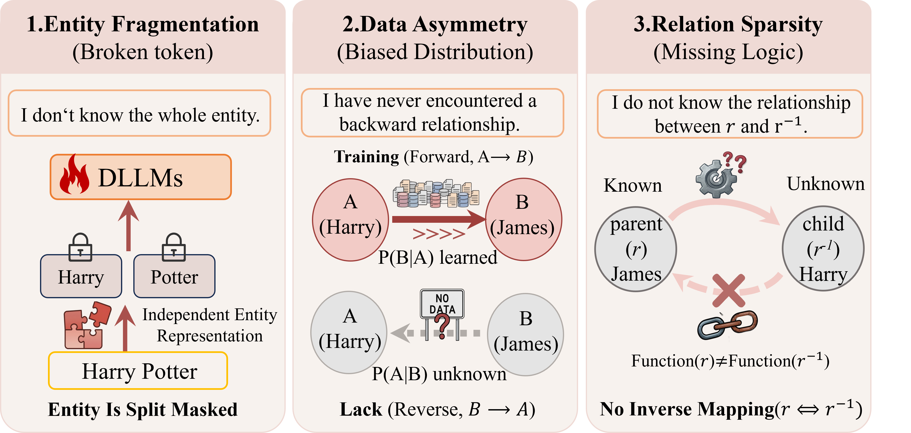

<div align="center">


# Shaokai He · Academic Homepage

**Exploring reasoning, multimodal intelligence, and language model agents.**

[](https://skhelife.github.io/)
[](https://scholar.google.com/citations?user=BviGcFwAAAAJ)
[](mailto:heshaokai@stu.cqu.edu.cn)

[About](https://skhelife.github.io/#about) · [Education](https://skhelife.github.io/#education) · [Publications](https://skhelife.github.io/#publications) · [Honors & Awards](https://skhelife.github.io/#awards)

</div>

---

## 👋 About me

I am **Shaokai He**, an **incoming student at Peking University (2027.09–2030.06)** and currently an undergraduate in **Computer Science and Technology** at **Chongqing University**, where I am part of the Top-notch Undergraduate Training Program.

My research centers on large language models: how they reason, how they connect information across modalities, and how they act as agents. I am particularly interested in the relationship between model reasoning, human cognition, and alignment.

## 🔬 Research interests

| Multimodal LLMs | LLM Agents | Alignment & Reasoning |
| :--- | :--- | :--- |
| Connecting language with other modalities. | Exploring models that plan, use tools, and solve tasks. | Understanding reasoning and its relationship to human cognition and logic. |

## 🎓 Education

| Institution | Program / Status | Period |
| :--- | :--- | :--- |
| **Peking University** | Incoming Student | **2027.09–2030.06** |
| **Chongqing University** | B.Eng. in Computer Science and Technology · Hongshen Honors School | 2023–Present |

## 📝 Featured publication

### DiffER: Diffusion Entity-Relation Modeling for Reversal Curse in Diffusion Large Language Models

**Shaokai He**, Kaiwen Wei, Yu Tian · **Findings of ACL 2026**

[](https://arxiv.org/abs/2601.07347)
[](https://github.com/skhelife/DiffER)

<a href="https://arxiv.org/abs/2601.07347">
  
</a>

## 🤝 Get in touch

I welcome research discussions, collaborations, and research internship opportunities.

- **Email:** [heshaokai@stu.cqu.edu.cn](mailto:heshaokai@stu.cqu.edu.cn)
- **GitHub:** [@skhelife](https://github.com/skhelife)
- **WeChat:** `skhelife`

---

<details>
<summary><strong>🛠️ Website source & local preview</strong></summary>

This repository contains the source for [my academic homepage](https://skhelife.github.io/), built with Jekyll and hosted on GitHub Pages.

| File / Directory | Purpose |
| :--- | :--- |
| [`_pages/about.md`](_pages/about.md) | Biography, education, publications, and awards |
| [`_config.yml`](_config.yml) | Site settings and sidebar profile |
| [`images/`](images/) | Profile photo, figures, and README banner |
| [`files/`](files/) | Downloadable documents |

With Ruby and Bundler installed, run:

```bash
bundle install
bundle exec jekyll serve --livereload
```

Open `http://localhost:4000` to preview the website.

</details>

<div align="center">

<sub>Built with <a href="https://academicpages.github.io/">Academic Pages</a>, based on <a href="https://mmistakes.github.io/minimal-mistakes/">Minimal Mistakes</a> · <a href="LICENSE">MIT License</a></sub>

</div>
